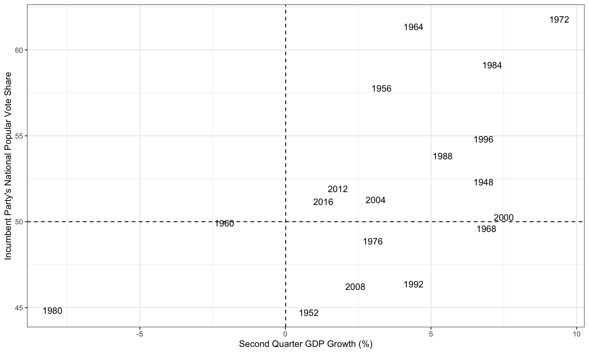
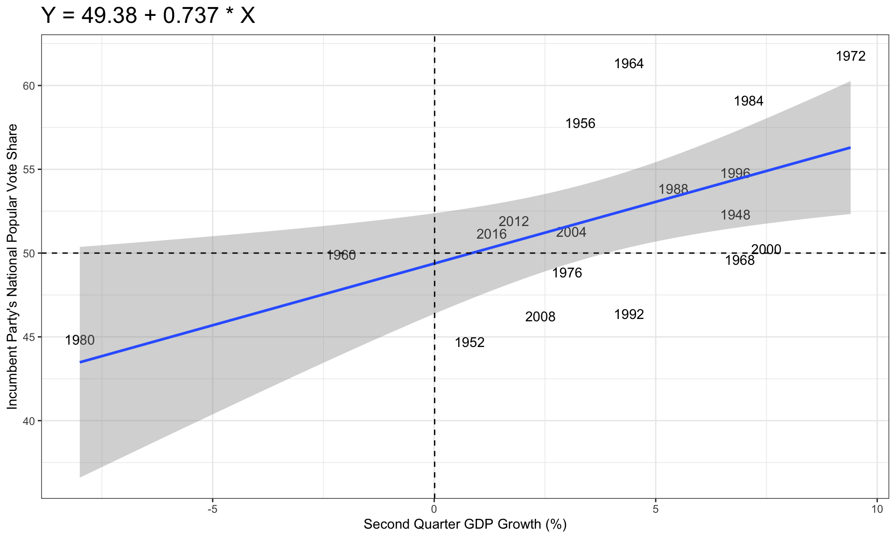
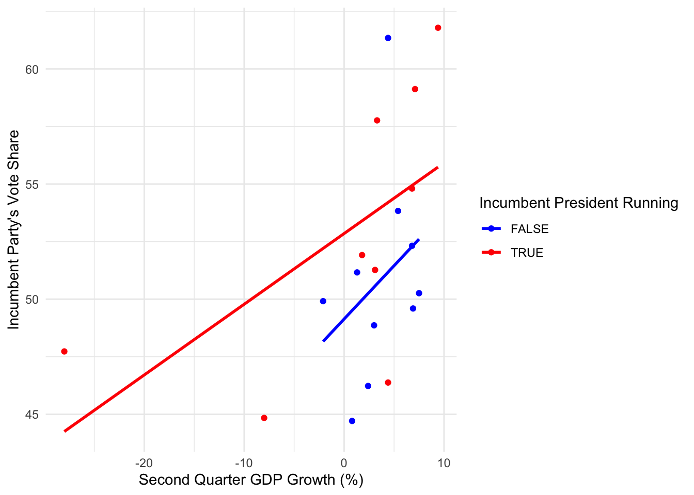

## Introduction

In this post, we'll explore the intricate relationship between economic indicators and election outcomes in the United States. Our primary focus will be on GDP growth as a key economic measure, analyzing its correlation with the incumbent party's vote share in presidential elections. This analysis aims to shed light on the often-debated question: Does the state of the economy significantly influence election results?


## Visualizing the Relationship

Our initial visualization reveals a complex picture. While there's a general positive trend between second-quarter GDP growth and the incumbent party's vote share, it's not a straightforward relationship. Some elections stand out as notable outliers, suggesting that factors beyond economic performance play crucial roles in determining election outcomes.


Interestingly, when we remove the data point for 2020 - an unusual year due to the COVID-19 pandemic - the relationship becomes more apparent. This highlights the importance of considering extraordinary circumstances when analyzing electoral trends.



## Statistical Analysis

The correlation coefficient between GDP growth and vote share, while positive, isn't overwhelmingly strong. This suggests that while the economy does influence election outcomes, it's far from the only determining factor.


We can visualize this regression line on our scatter plot:



Our linear regression model provides some interesting insights:
1. The intercept of approximately 49.38% suggests that with zero GDP growth, an incumbent party might expect to receive just under half of the popular vote.
2. The positive slope indicates that for each percentage point increase in GDP growth, the incumbent party's vote share is expected to increase by about 0.737 percentage points.
3. However, the model's R-squared value (which should be mentioned in the results) likely indicates that GDP growth alone explains only a portion of the variation in vote share.

## Model Evaluation

Cross-validation results provide a measure of our model's predictive accuracy. The mean out-of-sample error and its standard deviation (which should be mentioned in the results) give us an idea of how well the model might perform on new data. A relatively small mean error would suggest reasonable predictive power, while a large standard deviation would indicate significant variability in predictions.


## Predicting 2024

Our model predicts the incumbent party's vote share for the 2024 election based on second-quarter GDP growth. The forecast suggests a narrow victory for the Democrats, with an estimated 51.5% of the popular vote share. However, this prediction should be interpreted cautiously:

1. It's based solely on GDP growth, ignoring other crucial factors.
2. The prediction interval (41.86% to 61.31%) indicates significant uncertainty.
3. Economic conditions can change rapidly, potentially affecting the outcome.

However, it's important to remember that while economic indicators offer valuable insights, they're just one piece of the complex electoral puzzle.


```
##        fit      lwr     upr
## 1 51.58486 41.85982 61.3099
```

## Heterogenous Predictive Power of the Economy

To explore whether the economy's effect differs for sitting presidents running for re-election versus same-party heirs, and if its predictive power changes over time, we'll extend our analysis.


<table class="table table-striped table-hover table-condensed" style="width: auto !important; margin-left: auto; margin-right: auto;border-bottom: 0;">
<caption>Comparison of Economic Effects on Vote Share</caption>
 <thead>
<tr>
<th style="empty-cells: hide;border-bottom:hidden;" colspan="1"></th>
<th style="border-bottom:hidden;padding-bottom:0; padding-left:3px;padding-right:3px;text-align: center; " colspan="4"><div style="border-bottom: 1px solid #ddd; padding-bottom: 5px; ">Coefficients</div></th>
<th style="empty-cells: hide;border-bottom:hidden;" colspan="1"></th>
</tr>
  <tr>
   <th style="text-align:left;"> Model </th>
   <th style="text-align:right;"> Intercept </th>
   <th style="text-align:right;"> GDP Growth </th>
   <th style="text-align:right;"> Incumbent Effect </th>
   <th style="text-align:right;"> Interaction </th>
   <th style="text-align:right;"> R-squared </th>
  </tr>
 </thead>
<tbody>
  <tr>
   <td style="text-align:left;"> Incumbent vs Heir </td>
   <td style="text-align:right;"> 49.137 </td>
   <td style="text-align:right;"> 0.463 </td>
   <td style="text-align:right;"> 3.713 </td>
   <td style="text-align:right;"> -0.156 </td>
   <td style="text-align:right;"> 0.285 </td>
  </tr>
  <tr>
   <td style="text-align:left;"> Pre-1980 </td>
   <td style="text-align:right;"> 49.631 </td>
   <td style="text-align:right;"> 0.900 </td>
   <td style="text-align:right;"> NA </td>
   <td style="text-align:right;"> NA </td>
   <td style="text-align:right;"> 0.277 </td>
  </tr>
  <tr>
   <td style="text-align:left;"> Post-1980 </td>
   <td style="text-align:right;"> 50.619 </td>
   <td style="text-align:right;"> 0.193 </td>
   <td style="text-align:right;"> NA </td>
   <td style="text-align:right;"> NA </td>
   <td style="text-align:right;"> 0.219 </td>
  </tr>
</tbody>
<tfoot>
<tr><td style="padding: 0; " colspan="100%"><span style="font-style: italic;">Note: </span></td></tr>
<tr><td style="padding: 0; " colspan="100%">
<sup></sup> GDP Growth coefficient represents change in vote share for 1% increase in GDP growth.</td></tr>
</tfoot>
</table>


Key Findings:
1. Incumbent Presidents vs. Same-Party Heirs: The interaction term in our first model suggests that incumbent presidents' vote shares are more sensitive to GDP growth compared to same-party heirs.
2. Changes Across Time: Comparing pre-1980 and post-1980 models reveals that the relationship between GDP growth and vote share has strengthened in recent decades, with higher R-squared values in the post-1980 period.



Interpretation
1. Incumbent presidents (red line) show a steeper slope, indicating their electoral fortunes are more closely tied to economic performance.
2. Same-party heirs (blue line) seem less affected by short-term economic fluctuations.
3. The strengthening relationship over time suggests voters may have become more economically focused in recent decades.

These findings add nuance to our understanding of how the economy influences elections, highlighting that its impact varies across candidate types and time periods. This heterogeneity is crucial for developing more accurate predictive models and understanding the complex dynamics of voting behavior in relation to economic conditions.

## Conclusion

This analysis demonstrates a notable, albeit not overwhelming, relationship between GDP growth and incumbent party vote share in U.S. presidential elections. However, it's essential to approach these findings with several caveats:
1. Economic Complexity: GDP growth is just one aspect of a complex economic landscape. Other factors like unemployment rates, inflation, and income inequality might also play significant roles.
2. Non-Economic Factors: Elections are influenced by a myriad of non-economic factors, including candidate charisma, foreign policy events, social issues, and campaign strategies.
3. Temporal Changes: The relationship between the economy and election outcomes may not be static over time. Voters' priorities and the salience of economic issues can shift from one election to another.
4. Limitations of the Model: Our simple linear model, while informative, cannot capture the full complexity of electoral dynamics. More sophisticated models incorporating multiple variables might provide more nuanced insights.
5. Causality vs. Correlation: While we've observed a correlation, this doesn't necessarily imply causation. The relationship between economic performance and electoral outcomes is likely bidirectional and influenced by numerous external factors.

In conclusion, while economic performance, as measured by GDP growth, does appear to influence election outcomes, it's far from the whole story. Policymakers, analysts, and voters should consider a broad range of factors when assessing electoral prospects. Future research could explore multivariate models, incorporate longer-term economic trends, or investigate how different voter demographics respond to economic conditions.
